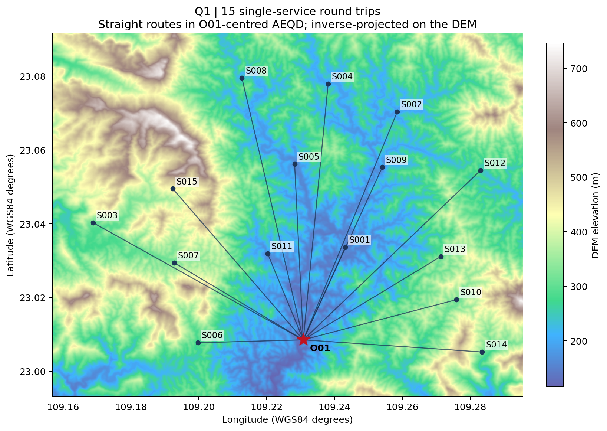
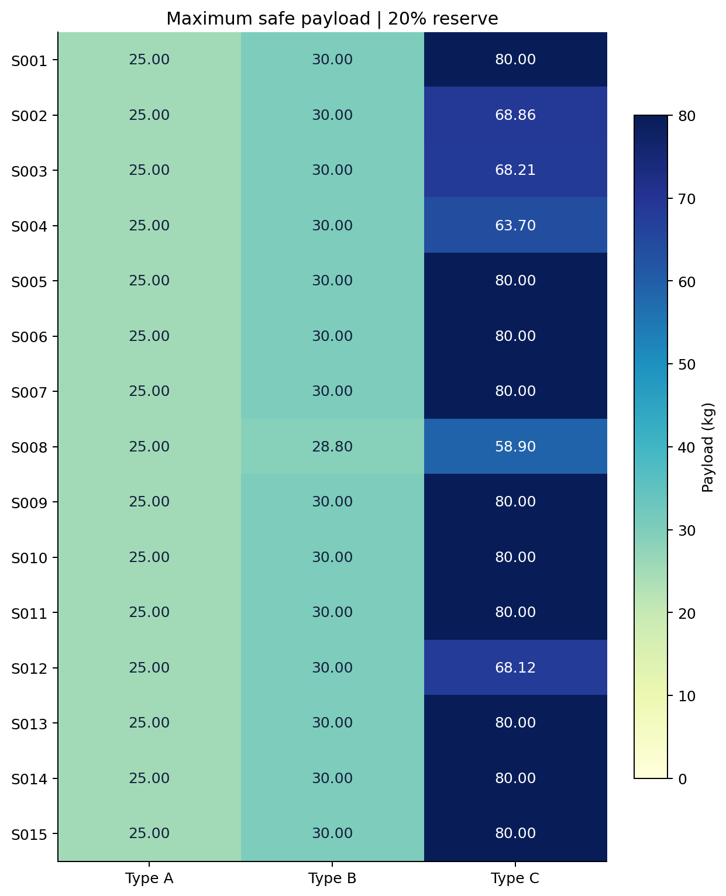
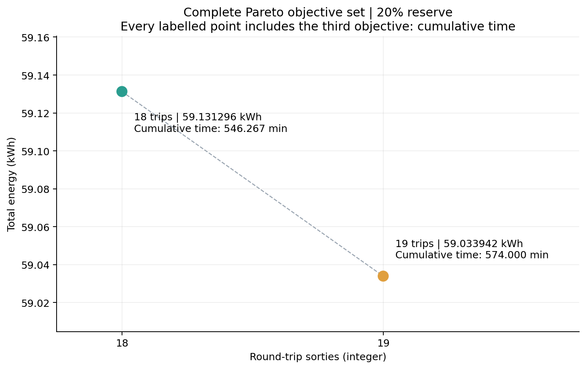
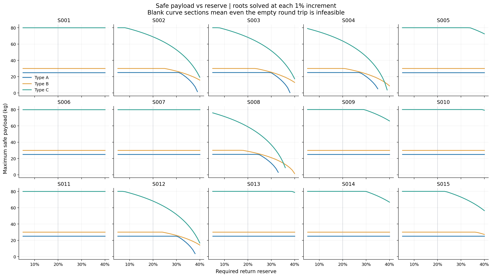
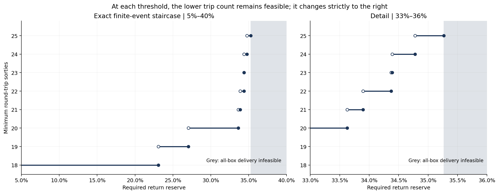

# 问题一计算结果

数据全部由原始附件重新读取。主模型采用用户确认的 O01 中心 WGS84 AEQD 平面直线与完整像元遍历，基准返航余量20%。所有数值是给定物理模型的计算结果，不是实际飞行测试数据。

## 基准词典序方案

先最少架次，再最低能耗，再最短累计作业时间：**18 架次、59.131296022053 kWh、546.266929148593 min**。这里的能耗最低以固定最少架次为前提；无架次限制的最低能耗见第二个 Pareto 点。逐箱分配共80行，见 `results/box_assignment.csv`，完整批次见 `optimal_batches.csv`。

| 架次 | 服务区 | 机型 | 箱数 | 质量 kg | 体积 m³ | 能耗 kWh | 累计贡献 min |
| --- | --- | --- | --- | --- | --- | --- | --- |
| Q1-001 | S001 | C | 6 | 76 | 0.170 | 2.917582308 | 24.902818 |
| Q1-002 | S001 | C | 9 | 78 | 0.224 | 2.995769263 | 28.202818 |
| Q1-003 | S002 | B | 3 | 25 | 0.067 | 2.713422287 | 30.278238 |
| Q1-004 | S002 | C | 5 | 56 | 0.144 | 5.721224671 | 34.030206 |
| Q1-005 | S003 | B | 3 | 25 | 0.067 | 2.779917468 | 34.675388 |
| Q1-006 | S003 | C | 5 | 56 | 0.144 | 5.764965115 | 39.501522 |
| Q1-007 | S004 | C | 6 | 59 | 0.156 | 6.152932019 | 38.350945 |
| Q1-008 | S005 | C | 6 | 59 | 0.156 | 4.222192860 | 31.286509 |
| Q1-009 | S006 | C | 6 | 59 | 0.156 | 2.597987865 | 26.025898 |
| Q1-010 | S007 | C | 5 | 45 | 0.129 | 3.410894380 | 31.792774 |
| Q1-011 | S008 | C | 5 | 45 | 0.129 | 5.836011711 | 36.661687 |
| Q1-012 | S009 | B | 3 | 25 | 0.067 | 2.096233734 | 25.974029 |
| Q1-013 | S010 | B | 3 | 25 | 0.067 | 1.823195698 | 25.922993 |
| Q1-014 | S011 | B | 3 | 25 | 0.067 | 1.073951765 | 19.807008 |
| Q1-015 | S012 | B | 3 | 25 | 0.067 | 2.752414299 | 32.045673 |
| Q1-016 | S013 | B | 3 | 25 | 0.067 | 1.824759272 | 25.174539 |
| Q1-017 | S014 | B | 3 | 25 | 0.067 | 2.140388482 | 31.162607 |
| Q1-018 | S015 | B | 3 | 25 | 0.067 | 2.307452824 | 30.471277 |

## 45 个最大安全载荷

| 服务区 | A / kg | B / kg | C / kg |
| --- | --- | --- | --- |
| S001 | 25.000000000 | 30.000000000 | 80.000000000 |
| S002 | 25.000000000 | 30.000000000 | 68.860342718 |
| S003 | 25.000000000 | 30.000000000 | 68.206490555 |
| S004 | 25.000000000 | 30.000000000 | 63.696955451 |
| S005 | 25.000000000 | 30.000000000 | 80.000000000 |
| S006 | 25.000000000 | 30.000000000 | 80.000000000 |
| S007 | 25.000000000 | 30.000000000 | 80.000000000 |
| S008 | 25.000000000 | 28.801233623 | 58.904360963 |
| S009 | 25.000000000 | 30.000000000 | 80.000000000 |
| S010 | 25.000000000 | 30.000000000 | 80.000000000 |
| S011 | 25.000000000 | 30.000000000 | 80.000000000 |
| S012 | 25.000000000 | 30.000000000 | 68.117193402 |
| S013 | 25.000000000 | 30.000000000 | 80.000000000 |
| S014 | 25.000000000 | 30.000000000 | 80.000000000 |
| S015 | 25.000000000 | 30.000000000 | 80.000000000 |

共45项，6项受能量约束，其余达到额定质量上限；这不是箱子体积容量，组批仍独立检查体积。载荷表包括预算、能量和返航SOC。

## 完整不同 Pareto 目标向量

| 架次 N | 总能耗 kWh | 累计时间 min |
| --- | --- | --- |
| 18 | 59.131296022053 | 546.266929148593 |
| 19 | 59.033942092203 | 573.999623452513 |

增加1架次可节省 0.097353930 kWh（0.164640%），累计时间增加 27.732694304 min。差异来自 S008 从一趟C型改为两趟B型。全部代表分配在 `pareto_assignments.json`；不声称枚举所有同目标的箱号互换方案。

## FFD 与精确解

| 机型范围 | 算法 | 架次 | 能耗 kWh | 累计 min |
| --- | --- | --- | --- | --- |
| A | exact | 52 | 112.180153141 | 1488.763007 |
| A | FFD_mass | 52 | 112.656636071 | 1488.763007 |
| A | FFD_volume | 55 | 118.909378452 | 1574.717453 |
| B | exact | 35 | 68.350657060 | 927.625473 |
| B | FFD_mass | 37 | 73.611560939 | 981.593921 |
| B | FFD_volume | 37 | 72.936489430 | 981.593921 |
| C | exact | 18 | 73.934908445 | 563.979235 |
| C | FFD_mass | 18 | 75.116696588 | 563.979235 |
| C | FFD_volume | 18 | 75.116696588 | 563.979235 |
| mixed | exact | 18 | 59.131296022 | 546.266929 |
| mixed | FFD_mass | 18 | 75.116696588 | 563.979235 |
| mixed | FFD_volume | 18 | 75.116696588 | 563.979235 |

FFD 两种排序均明确是启发式 baseline。混型 FFD 新开架次优先额定载荷较大的机型，所以本数据选到C型；其18架次虽达到最少架次，能耗仍显著高于精确混型方案。不同新建架次策略会有不同FFD结果，不能将本对照解释为所有启发式的能力上限。

## 安全余量临界点

在完整 [0,1) 范围枚举 569 个不同候选事件；8 个全局架次变化（最后一个转为不可行），19 个最优模式代表变化。5%–40% 网格另有36×45条安全载荷记录。

| 阈值 α / % | 受影响服务区 | 左侧与阈值自身架次 | 严格右侧架次 |
| --- | --- | --- | --- |
| 23.088349763663 | S004 | 18 | 19 |
| 27.049853606455 | S008 | 19 | 20 |
| 33.625809189918 | S008 | 20 | 21 |
| 33.896917675205 | S003 | 21 | 22 |
| 34.373531555926 | S004 | 22 | 23 |
| 34.391872518260 | S002 | 23 | 24 |
| 34.777897199273 | S008 | 24 | 25 |
| 35.267806887191 | S008 | 25 | 不可行 |

阈值本身仍可行：区间采用首段左闭、后续左开、右闭；1是定义域外端点。阈值CSV保留未四舍五入的完整浮点值，百分比展示值不可直接用于边界判定。

超过最后阈值时，S008 的14kg饮用水单箱已无任何机型可行，而货箱不能拆分，因此全任务不可行。最优模式改变的详细区间在 `reserve_optimal_segments.csv`；架次不变也可能因某种批型失效而更换机型或拆分组合。

## 空间交叉检查与回归

AEQD 与 WGS84 测地距离最大绝对差 1.41153577715e-09 m，最大相对差 2.90896221041e-13；最大载荷差 1.84314785656e-11 kg。两者可行模式集合和选中组批代表完全相同；目标差低于数值容差。Q1 径向投影性质解释了这种一致性，主模型没有改成测地距离。

原始箱级 MILP、对称压缩 MILP 与 DP 在15区的目标均一致。最后的历史回归状态：**MATCH**。完整枚举与独立重算才构成优化证据，回归匹配只作外部一致性检查。

## 图

